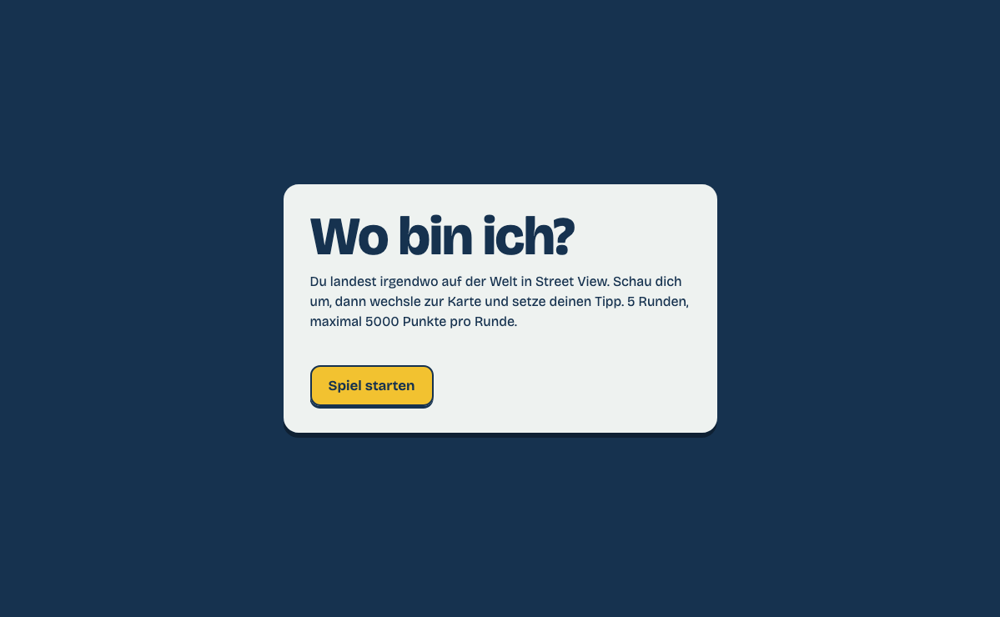
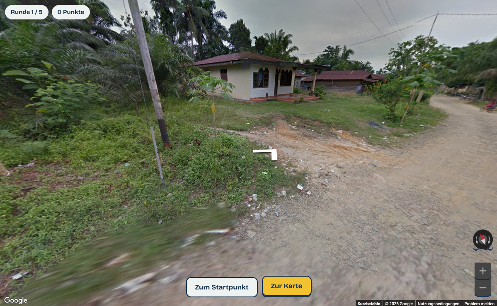
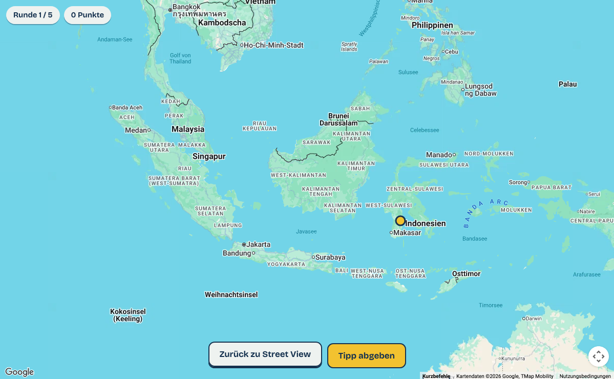
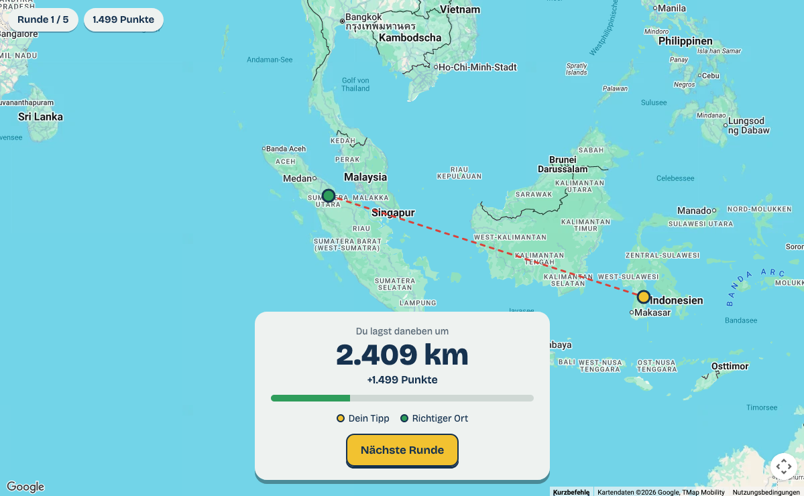

# GEOGUESS
Einfache Geoguessing Spiel mit Google Street View

## Spielablauf
So läuft das Spiel ab: Du landest an einem zufälligen Ort in Street View (ohne Adresse und Strassennamen) und kannst dich umschauen und herumlaufen. Mit „Zur Karte“ wechselst du auf die Weltkarte, klickst deinen Tipp an und bestätigst. Danach erscheinen der richtige Ort (grün), dein Tipp (gelb) und eine gestrichelte rote Linie dazwischen, zusammen mit der Entfernung in km und den Punkten. Es gibt 5 Runden mit maximal 5000 Punkten pro Runde, ähnlich wie bei GeoGuessr.

## API
Was du brauchst: einen Google Maps API-Schlüssel. Den bekommst du in der Google Cloud Console. Dort legst du ein Projekt an, aktivierst die „Maps JavaScript API“ und richtest Billing ein. Das ist Pflicht, aber Google gewährt ein monatliches Gratiskontingent, das für privates Spielen normalerweise reicht. 

## Versionen

### geoguess.html
Den Schlüssel gibst du beim Start im Spiel ein, er wird dann lokal im Browser gespeichert.

### geoguess_api.html
Den Schlüssel trägst du in der HTML-Datei ein. Die Datei kannst Du lokal hosten, aber niemals im Internet. Ein öffentlicher API key verursacht Kosten.
```
157 // >>> HIER DEINEN GOOGLE MAPS API-SCHLÜSSEL EINTRAGEN <<<
158 const API_KEY = "....";
```

## Funktionsweise
Wie der zufällige Ort gefunden wird: Komplett zufällige Koordinaten würden meistens im Meer oder in der Wüste landen. Deshalb wählt das Skript einen zufälligen Punkt in Regionen mit guter Street-View-Abdeckung (Europa, USA, Japan, Brasilien usw.). Dann sucht es mit StreetViewService.getPanorama() im Umkreis von 50 km das nächste offizielle Google-Panorama. Die Liste REGIONS oben im Skript kannst du leicht anpassen, zum Beispiel nur für die Schweiz oder Europa.

## Screenshots

### Anfang


### Wo bin ich?


### Tip abgeben


### Auflösung



## Google API Key

Die Google Cloud Console findest du unter https://console.cloud.google.com. Du meldest dich dort mit deinem normalen Google-Konto an.

Für das Spiel gehst du dann so vor:

Projekt anlegen: Oben links neben dem Google-Cloud-Logo auf die Projektauswahl klicken, dann auf „Neues Projekt“. Du kannst es zum Beispiel „Geoguess“ nennen.
Billing einrichten: Im Menü (☰) auf „Abrechnung“ gehen und ein Rechnungskonto mit Kreditkarte verknüpfen. Ohne das funktioniert die Maps API nicht, auch wenn du im Gratiskontingent bleibst.
API aktivieren: Im Menü „APIs & Dienste“ → „Bibliothek“ öffnen, nach „Maps JavaScript API“ suchen und auf „Aktivieren“ klicken.
Schlüssel erstellen: Unter „APIs & Dienste“ → „Anmeldedaten“ auf „Anmeldedaten erstellen“ → „API-Schlüssel“ klicken. Der Schlüssel beginnt mit AIza…. Diesen kopierst du ins Spiel.

Zur Sicherheit kannst du den Schlüssel danach einschränken. Klick ihn in der Liste an und wähle unter „API-Einschränkungen“ nur die Maps JavaScript API aus. Die Einschränkung auf Websites lässt du am besten weg, solange du die Datei lokal von deinem Computer aus öffnest. Sonst lehnt Google den Schlüssel ab.

Die Oberfläche ändert sich ab und zu ein wenig, die Menüpunkte können also leicht anders heissen. Die Grundstruktur bleibt aber gleich.